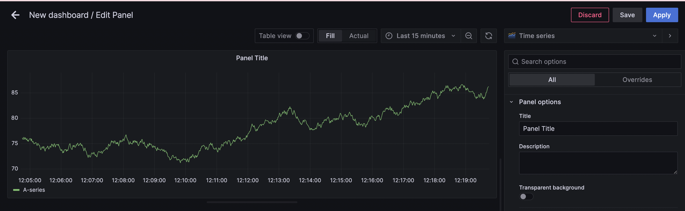

Deployment of Monitoring Stack in Kubernetes
This step-by-step guide will help you deploy a monitoring stack that includes OpenTelemetry, Prometheus, Fluentbit, Grafana Loki, and Grafana in Kubernetes.

Prerequisites
Kubernetes installed.
Helm installed.
Flux installed.
Steps
1.Install Flux in your cluster:
<pre> flux install </pre> 
2.Open your Flux repository in a browser, open the .flux.yaml file, and set git.path to the path of your project.
3.Change git.url in .flux.yaml file to the URL of your Git repository.
4.Run the command:
<pre> flux reconcile source git flux-system</pre> 
5.Run the command:
<pre>kubectl apply -f <path-to-your-loki-config> # Example: kubectl apply -f /path/to/loki-local-config.yaml</pre>
6.Install and configure OpenTelemetry and Fluentbit:
Add the OpenTelemetry repository:
<pre>helm repo add open-telemetry https://open-telemetry.github.io/opentelemetry-helm-charts
helm repo update</pre>
Deploy OpenTelemetry Collector:
<pre>helm upgrade --install otel-collector open-telemetry/opentelemetry-collector -n <your-namespace> --create-namespace</pre>
Add the Fluentbit repository:
<pre>helm repo add fluent https://fluent.github.io/helm-charts
helm repo update</pre>
Deploy Fluent Bit:
<pre>helm upgrade --install fluent-bit fluent/fluent-bit -n <your-namespace></pre>
7. To set up Prometheus, run the following commands:
<pre>helm repo add prometheus-community https://prometheus-community.github.io/helm-charts
helm repo update
helm upgrade --install prometheus prometheus-community/prometheus -n <your-namespace> --create-namespace</pre>
8.To set up Grafana Loki, run the following commands:
<pre>helm repo add grafana https://grafana.github.io/helm-charts
helm repo update
helm upgrade --install loki grafana/loki -n <your-namespace></pre>
9.To set up Grafana, run the following commands:
<pre>helm upgrade --install grafana grafana/grafana -n <your-namespace> </pre>

By following these steps, you'll deploy all necessary monitoring components in your Kubernetes cluster.

